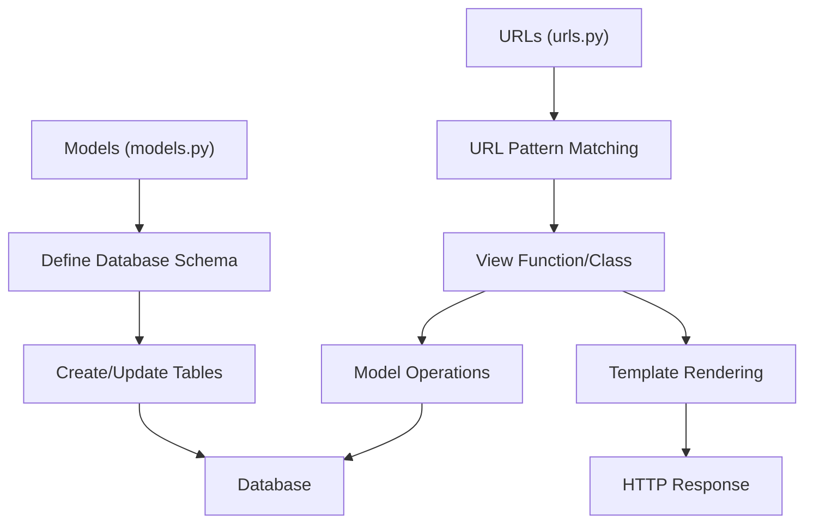

# Django step by step

# Installation process

- create a empty folder and in that open terminal and create virtual environment to install django
    
    ```bash
    # Create virtual environment
    python -m venv env
    
    # Activate virtual environment
    # On Windows:
    env\Scripts\activate
    # On macOS/Linux:
    source env/bin/activate
    
    # Install Django
    pip install django
    
    # Verify installation
    python -m django --version
    ```
    
- Now run another command to start django project
    
    ```bash
    # Create new Django project
    django-admin startproject projectname
    
    # Change into project directory
    cd projectname
    
    # Create new app
    python manage.py startapp appname
    
    # Run development server
    python manage.py runserver
    ```
    
- Now Understand MVC architecture of django and also how it works
    
    ```mermaid
    graph TD;
        A["Client/Browser"] --> B["URLs/Routes"];
        B --> C["Views"];
        C --> D["Models"];
        D --> E["Database"];
        C --> F["Templates"];
        F --> G["Rendered HTML"];
        G --> A;
    
        %% Additional details
        B["URLs/Routes<br/>(urls.py)"]
        C["Views<br/>(views.py)"]
        D["Models<br/>(models.py)"]
        F["Templates<br/>(HTML files)"]
    ```
    
    Django follows an MVT (Model-View-Template) architecture, which is similar to MVC:
    
    - **Model (models.py):** Handles data and database operations
    - **View (views.py):** Contains business logic and processes requests
    - **Template (HTML files):** Handles presentation and user interface
    
    The flow works as follows:
    
    1. User sends request to Django application
    2. URL dispatcher ([urls.py](http://urls.py)) routes request to appropriate view
    3. View processes request, interacts with model if needed
    4. Model handles data operations with database
    5. View passes data to template
    6. Template renders HTML response
    7. Response is sent back to user's browser
- Now to run the django project go into the project directory and run this command
    
    ```bash
    # Run Django development server
    python manage.py runserver
    
    # The server will start at http://127.0.0.1:8000/
    # To change port (optional):
    python manage.py runserver 8080
    ```
    
    After running this command, you can access your Django project by opening a web browser and navigating to [http://127.0.0.1:8000/](http://127.0.0.1:8000/)
    
    - Now create a views file and remeber the file name must be views because its a framework rules.
        
        ```
        projectname/
        │
        ├── manage.py
        ├── projectname/
        │   ├── __init__.py
        │   ├── settings.py
        │   ├── urls.py
        │   ├── asgi.py
        │   └── wsgi.py
        │
        └── appname/
            ├── __init__.py
            ├── admin.py
            ├── apps.py
            ├── models.py
            ├── tests.py
            ├── views.py
            ├── urls.py
            └── templates/
                └── appname/
                    └── template.html
        ```
        
        Key files and their purposes:
        
        - **manage.py:** Command-line utility for administrative tasks
        - **settings.py:** Project configuration settings
        - **urls.py:** URL declarations for the project
        - **wsgi.py/asgi.py:** Entry points for web servers
        - **views.py:** Contains view functions/classes
        - **models.py:** Database models and relationships
        - **admin.py:** Django admin interface configuration
        - **templates/:** Directory for HTML templates
        
    - Django Template Engine Explanation
        
        Django's template engine is a powerful system for generating dynamic HTML. It allows you to define skeleton HTML files with special syntax to insert dynamic content.
        
        ### Key Template Features:
        
        - **Variables:** Use {{ variable_name }} to display variables passed from views
        - **Tags:** Use  for programming logic like loops and conditions
        - **Filters:** Use {{ variable|filter_name }} to modify variable output
        
        ### Common Template Tags:
        
        ```html
        {# This is a comment #}
        
        <!-- For loops -->
        
            {{ item.name }}
        
        
        <!-- If conditions -->
        
            Welcome {{ user.username }}
        
            Please log in
        
        
        <!-- Extending base templates -->
        
        
            <!-- Your content here -->
        
        ```
        
        ### Template Inheritance:
        
        - **Base Template:** Create a skeleton template with common elements
        - **Block Tags:** Define sections that child templates can override
        - **Extends Tag:** Child templates inherit from base template
        
        Example of template inheritance structure:
        
        ```html
        <!-- base.html -->
        <!DOCTYPE html>
        <html>
        <head>
            <title>Default Title</title>
        </head>
        <body>
            
            
        </body>
        </html>
        
        <!-- child.html -->
        
        
        My Page Title
        
        
            <h1>Welcome to my page</h1>
        
        ```
        
        ### Template Filters:
        
        - **date:** {{ date|date:"Y-m-d" }}
        - **length:** {{ list|length }}
        - **lower/upper:** {{ string|lower }}
        - **default:** {{ value|default:"nothing" }}
        
        Templates should be placed in your app's templates directory, typically organized as:
        
        ```bash
        appname/
            templates/
                appname/
                    base.html
                    home.html
                    detail.html
        ```
        
- Loading Static Files in Django
    
    Follow these steps to properly load and use static files (CSS, JavaScript, images) in Django:
    
    ### 1. Configure Static Files Settings
    
    ```python
    # In settings.py
    import os
    
    STATIC_URL = 'static/'
    
    STATICFILES_DIRS = [
        os.path.join(BASE_DIR, 'static')
    ]
    
    STATIC_ROOT = os.path.join(BASE_DIR, 'staticfiles')
    ```
    
    ### 2. Create Static Directory Structure
    
    ```bash
    your_project/
        └── static/
            ├── css/
            │   └── style.css
            ├── js/
            │   └── script.js
            └── images/
                └── logo.png
    ```
    
    ### 3. Load Static Files in Templates
    
    ```html
    
    <!DOCTYPE html>
    <html>
    <head>
        <title>My Django App</title>
        <link rel="stylesheet" href="">
        <script src=""></script>
    </head>
    <body>
        
    </body>
    </html>
    ```
    
    ### 4. Collect Static Files (for Production)
    
    ```bash
    # Run this command before deployment
    python manage.py collectstatic
    ```
    
    Important Notes:
    
    - **Development:** Django automatically serves static files during development
    - **Production:** You'll need to configure your web server to serve static files
    - **Best Practice:** Always use  template tag instead of hardcoding paths
    
    ### Example CSS File (style.css)
    
    ```css
    /* static/css/style.css */
    body {
        font-family: Arial, sans-serif;
        margin: 0;
        padding: 20px;
        background-color: #f0f0f0;
    }
    
    .container {
        max-width: 1200px;
        margin: 0 auto;
        background-color: white;
        padding: 20px;
        border-radius: 5px;
        box-shadow: 0 0 10px rgba(0,0,0,0.1);
    }
    ```
    
- Django Views and Templates Example
    
    Here's how to set up views to render templates in Django:
    
    ```python
    # views.py
    from django.http import HttpResponse
    from django.shortcuts import render
    
    def home(request):
        # Using render to return a template
        context = {
            'title': 'Home Page',
            'welcome_message': 'Welcome to our site!'
        }
        return render(request, 'index.html', context)
    
    def about(request):
        # Using render to return a template with context data
        context = {
            'title': 'About Us',
            'description': 'Learn more about our company'
        }
        return render(request, 'about.html', context)
    
    def contact(request):
        # Simple HttpResponse example
        return HttpResponse("hello your at contact page")
    ```
    
    The render function takes three arguments:
    
    - **request:** The HTTP request object
    - **template_name:** The path to your HTML template
    - **context (optional):** A dictionary of data to pass to the template
    
    Corresponding template example:
    
    ```html
    <!-- templates/index.html -->
    
    
    
        <h1>{{ title }}</h1>
        <p>{{ welcome_message }}</p>
    
    ```
    
- Benefits of Using Jinja2 for Developers
    
    Understanding why Jinja2 is valuable for developers in Django projects:
    
    ### 1. Development Efficiency
    
    - **Cleaner Syntax:** More intuitive and Python-like syntax reduces learning curve
    - **Better Error Handling:** Provides more detailed error messages for debugging
    - **Code Reusability:** Powerful macro system for reusing template components
    
    ### 2. Performance Advantages
    
    - **Faster Rendering:** Jinja2's compiled templates execute faster than Django's template engine
    - **Memory Efficient:** Better memory usage due to its compiled nature
    - **Scalability:** Better performs under heavy loads and complex templates
    
    ### 3. Advanced Features
    
    ```html
    {# Example of advanced Jinja2 features #}
    {# Macros for reusable components #}
    
        <input type="{{ type }}" name="{{ name }}" value="{{ value }}">
    
    
    {# Template inheritance with blocks #}
    
    
        {{ input_field('username') }}
        {{ input_field('password', type='password') }}
    
    ```
    
    ### 4. Real-world Applications
    
    - **Large-scale Projects:** Better suited for complex applications with numerous templates
    - **API Integration:** Excellent for handling JSON data and API responses
    - **Dynamic Content:** Superior handling of dynamic content generation
    
    ### 5. Developer-friendly Features
    
    - **Sandbox Environment:** Secure template execution with customizable security
    - **IDE Support:** Better syntax highlighting and code completion in most IDEs
    - **Documentation:** Extensive documentation and large community support
    
    ### 6. Practical Example
    
    ```python
    # views.py
    def dashboard(request):
        context = {
            'user_data': {
                'name': 'John Doe',
                'projects': ['Project A', 'Project B'],
                'tasks': get_user_tasks()
            },
            'analytics': get_analytics_data(),
            'permissions': get_user_permissions()
        }
        return render(request, 'dashboard.html', context)
    ```
    
    ```html
    {# dashboard.html (Jinja2) #}
    
    
    
        {# Complex data handling made easy #}
        
            
                {{ render_metric_component(metric) }}
            
        
    
        {# Custom filtering and formatting #}
        
            <div class="project-card">
                {{ project.name|title }}
                {{ project.deadline|format_date('%Y-%m-%d') }}
            </div>
        
    
    ```
    
    This advanced template system is particularly valuable for:
    
    - **Team Development:** Easier collaboration with clear syntax and maintainable code
    - **Complex Applications:** Better handling of sophisticated template logic
    - **Performance-Critical Projects:** Improved rendering speed for better user experience
    - **Microservices Architecture:** Seamless integration with various data sources and APIs

Django Models and URLs Flow



## Models in Django

```python
# models.py
from django.db import models

class Product(models.Model):
    name = models.CharField(max_length=100)
    price = models.DecimalField(max_digits=10, decimal_places=2)
    description = models.TextField()
    created_at = models.DateTimeField(auto_now_add=True)
    
    def __str__(self):
        return self.name
```

### Common Model Fields:

- **CharField:** For short strings
- **TextField:** For longer text
- **IntegerField:** For integers
- **DateTimeField:** For dates and times
- **ForeignKey:** For relationships between models

## URL Configuration

```python
# urls.py
from django.urls import path
from . import views

urlpatterns = [
    path('', views.home, name='home'),
    path('products/', views.product_list, name='product-list'),
    path('products/<int:pk>/', views.product_detail, name='product-detail'),
    path('products/create/', views.product_create, name='product-create'),
]
```

### URL Pattern Components:

- **Path Converters:** `int`, `str`, `slug`, `uuid`, `path`
- **Named URLs:** Use name parameter for reverse URL lookup
- **URL Parameters:** Captured from URL and passed to views

Remember to:

- Make migrations after model changes: `python manage.py makemigrations`
- Apply migrations: `python manage.py migrate`
- Include app URLs in project's main [urls.py](http://urls.py)
- Use reverse() or url template tag for dynamic URL generation